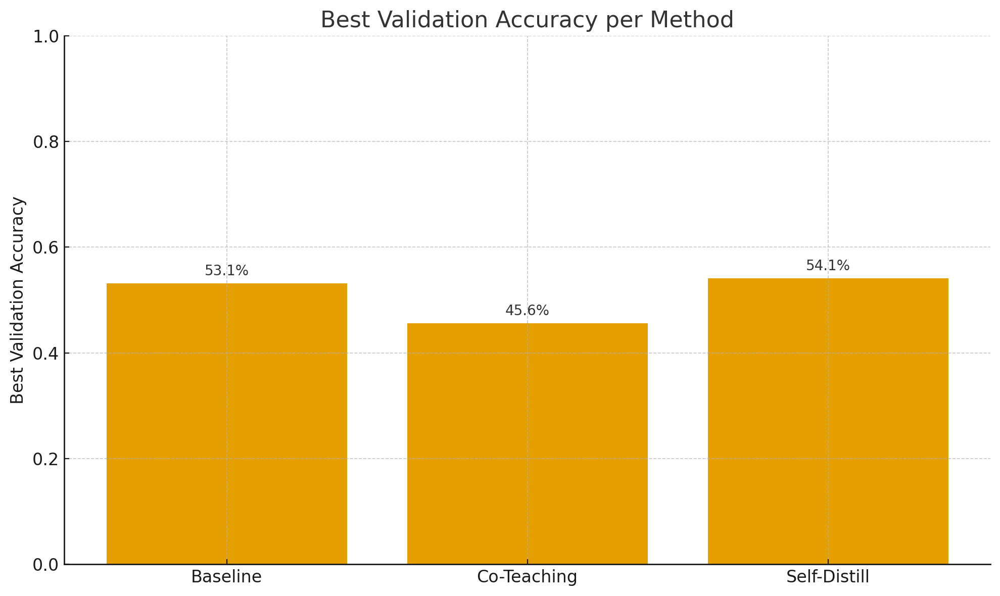
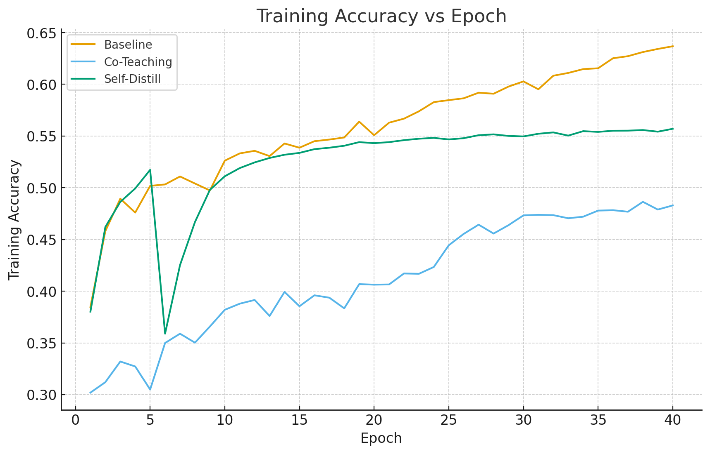
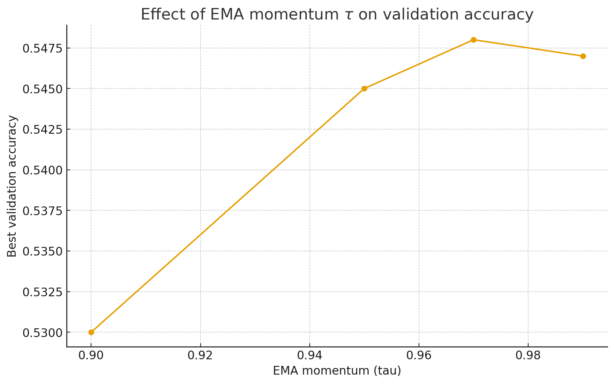
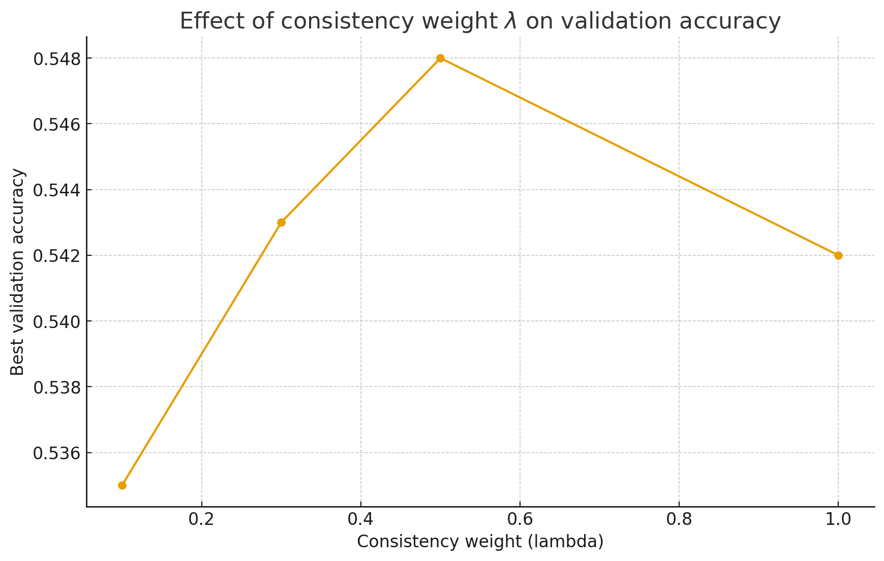
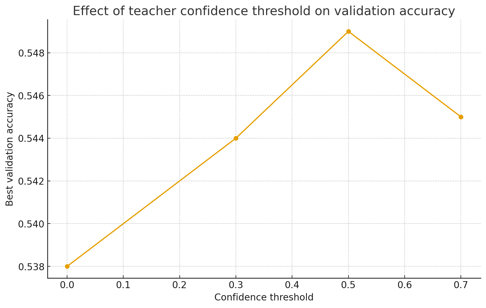

# Noise-Aware Self-Distillation with Confidence Reweighting for Robust Image Classification

This project compares three different approaches for training deep neural networks on noisy labeled data using the CIFAR-10N dataset. The methods evaluated are:

1. **Baseline**: Standard cross-entropy training on noisy labels
2. **Co-Teaching**: A method that trains two networks simultaneously, where each network selects clean samples for the other
3. **Self-Distill**: Self-distillation approach using a teacher-student framework with confidence-based filtering

## Results Overview

### Best Validation Accuracy Comparison

The bar chart above shows the best validation accuracy achieved by each method:
- **Self-Distill**: 54.1% (best performing)
- **Baseline**: 53.1%
- **Co-Teaching**: 45.6%

Self-Distill outperforms both Baseline and Co-Teaching, demonstrating the effectiveness of the self-distillation approach for learning with noisy labels.

## Training and Validation Performance

### Training Loss

.png)

The training loss comparison reveals distinct behaviors:
- **Self-Distill**: After an initial spike at epoch 6, achieves the lowest training loss (~0.45 at epoch 40), demonstrating effective learning despite the noisy labels
- **Baseline**: Shows steady, gradual decrease in loss, ending at ~1.1
- **Co-Teaching**: Maintains the highest and most volatile training loss (~3.5), indicating difficulty in learning from the noisy data

### Training Accuracy

Training accuracy trends:
- **Baseline**: Achieves the highest training accuracy (~63% at epoch 40), though this may indicate overfitting to noisy labels
- **Self-Distill**: Shows strong performance (~55.5% at epoch 40) with a notable recovery after a sharp drop at epoch 6
- **Co-Teaching**: Consistently underperforms, reaching only ~48% accuracy

### Validation Loss

.png)

Validation loss provides insights into generalization:
- **Self-Distill**: Achieves the most stable and consistently lowest validation loss (~1.8 at epoch 40) after epoch 8, indicating the best generalization
- **Baseline**: Shows a major spike at epoch 8 but recovers to maintain low loss (~1.9), though with some volatility
- **Co-Teaching**: Maintains the highest validation loss (~3.7) with significant fluctuations throughout training

### Validation Accuracy

Validation accuracy (the key metric for generalization):
- **Self-Distill**: Consistently achieves the highest validation accuracy (~53% at epoch 40) after recovering from an early dip at epoch 6, demonstrating superior generalization
- **Baseline**: Shows strong initial performance but becomes volatile in later epochs, ending at ~47%
- **Co-Teaching**: Starts lowest but shows steady improvement, ending at ~45.5%

**Key Insight**: While Baseline achieves higher training accuracy, Self-Distill achieves better validation accuracy, suggesting it generalizes better and is less prone to overfitting to noisy labels.

## Hyperparameter Sensitivity Analysis

### EMA Momentum (τ) Sweep

The EMA momentum parameter controls how quickly the teacher model updates in the self-distillation framework. The sweep shows:
- Optimal value: **τ = 0.97** achieves peak validation accuracy (~54.78%)
- Performance increases from τ = 0.90 to τ = 0.97
- Slight decrease beyond τ = 0.97, indicating an optimal range

### Consistency Weight (λ) Sweep

The consistency weight balances the cross-entropy loss with the distillation loss:
- Optimal value: **λ = 0.5** achieves peak validation accuracy (~54.8%)
- Performance improves from λ = 0.1 to λ = 0.5
- Decreases beyond λ = 0.5, suggesting too much weight on consistency can be detrimental

### Confidence Threshold Sweep

The confidence threshold determines which samples the teacher model uses for distillation:
- Optimal value: **Confidence threshold = 0.5** achieves peak validation accuracy (~54.9%)
- Performance increases from threshold 0.0 to 0.5
- Decreases beyond 0.5, indicating that filtering too aggressively removes useful training signal

## Key Findings

1. **Self-Distill is the best performing method**, achieving 54.1% validation accuracy compared to 53.1% for Baseline and 45.6% for Co-Teaching.

2. **Self-Distill shows superior generalization**: Despite lower training accuracy than Baseline, it achieves higher validation accuracy, suggesting better robustness to noisy labels.

3. **Hyperparameter tuning is critical**: The optimal hyperparameters for Self-Distill are:
   - EMA momentum (τ): 0.97
   - Consistency weight (λ): 0.5
   - Confidence threshold: 0.5

4. **Co-Teaching struggles with high noise**: The method shows difficulty learning from the noisy CIFAR-10N dataset, maintaining high loss and low accuracy throughout training.

5. **Baseline shows instability**: While Baseline performs well initially, it shows volatility in later epochs, particularly evident in the validation loss spike at epoch 8.

## Dataset

This project uses **CIFAR-10N**, a variant of CIFAR-10 with human-annotated noisy labels. The experiments use the "worse_label" noise level, which contains approximately 40% label noise.

## Code

The implementation is available in `final_code.py`, which includes:
- Data loading and preprocessing for CIFAR-10N
- Implementation of Baseline, Co-Teaching, and Self-Distill methods
- Training loops with proper evaluation
- Hyperparameter sweep functionality
- Visualization code for generating the comparison plots

## Requirements

See the code for required dependencies. Key libraries include:
- PyTorch
- torchvision
- matplotlib
- numpy
- pandas

## Usage

Run the experiments using `final_code.py` with appropriate configuration. The code supports:
- Training individual methods
- Running hyperparameter sweeps
- Generating comparison plots
